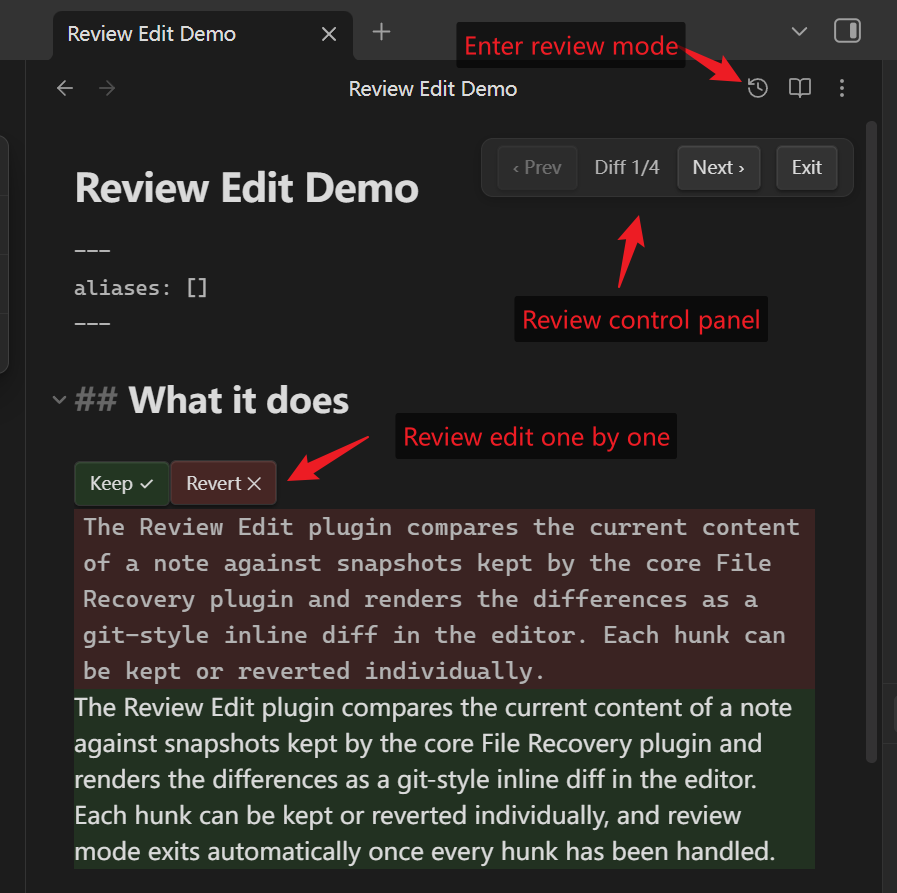
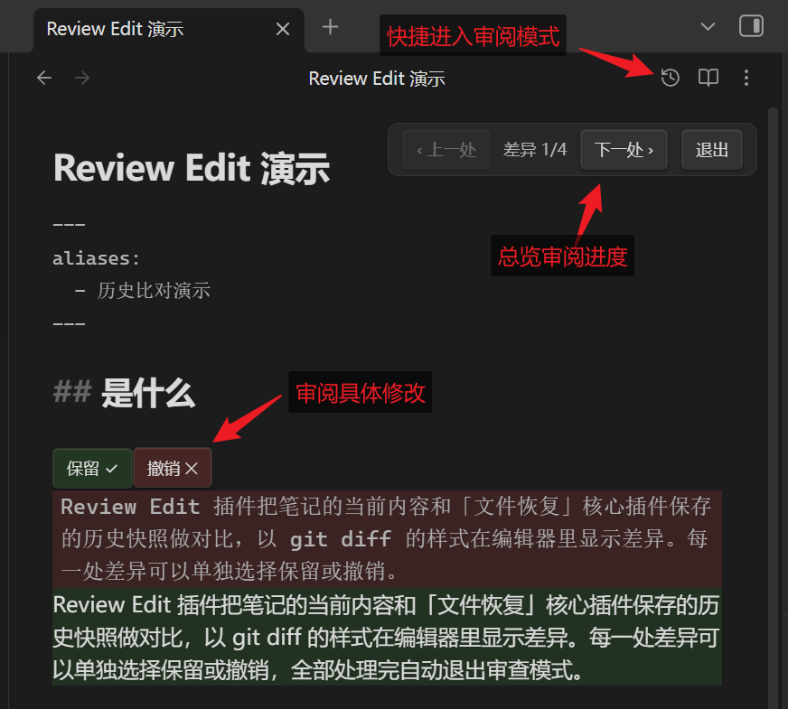

# Review Edit

Review the changes in a note against a historical snapshot, rendered as a git-style inline diff inside the Obsidian editor. Keep (✓) or revert (✕) each diff hunk individually. Snapshots come from the core **File Recovery** plugin — no git required. The interface language follows Obsidian's display language (English and Chinese are built in).



## Usage

1. Make sure the core plugin **File Recovery** is enabled (Settings → Core plugins → File recovery; it is on by default).
2. Edit a note. Snapshots are taken automatically every snapshot interval (5 minutes by default).
3. Start a review from any of the three entry points: the history button (clock icon) at the top right of the editor, the ribbon icon on the left sidebar, or the command **Compare with an earlier snapshot** to pick a baseline snapshot. The command **Compare with the previous snapshot** skips the picker and diffs against the most recent differing snapshot.
4. Green lines were added since the baseline; red blocks are old content that was removed.
5. A navigation bar **"‹ Prev | Diff i/n | Next ›"** appears at the top right and bottom right of the editor. *n* is the number of pending hunks; the buttons jump between hunks, and entering review mode scrolls to the first hunk.
6. **Keep ✓** keeps the current text. **Revert ✕** restores the old text for that hunk, and the counter decreases. When every hunk is handled, review mode exits automatically. The navigation bar also has an exit button (or press `Esc`) — unhandled changes are all kept.

## Known limitations

- Snapshots lag behind your edits by up to one snapshot interval (5 minutes by default), and only the last 7 days are retained. Both can be changed in the File Recovery settings.
- The snapshot picker only lists snapshots that differ from the current content. Obsidian sometimes stores snapshots without content changes (e.g. when a file is renamed); those entries are hidden automatically.
- The editor is read-only while in diff mode; if the file is modified externally, the mode exits automatically.
- A note that has never been edited has no snapshots to compare against.

## Compatibility

Reading snapshots relies on the internal IndexedDB structure of the File Recovery core plugin (the same approach as the Time Machine community plugin). There is no public API for this. If an Obsidian update breaks it, only `src/snapshot-source.ts` needs to be adapted.

## Development

```bash
npm install
npm run dev        # watch build
npm test           # vitest unit tests
npm run build      # production main.js
npm run lint       # eslint (includes obsidianmd plugin guidelines)
```

Manual install into a vault: copy `main.js`, `styles.css`, and `manifest.json` into `<vault>/.obsidian/plugins/review-edit/`.

## Releasing

1. Run `npm version patch` (or `minor`/`major`) — this bumps `package.json` and, via `version-bump.mjs`, syncs `manifest.json` and `versions.json`.
2. Push the commit and the tag. The tag must be the exact version number **without** a `v` prefix (e.g. `1.0.1`). The `.github/workflows/release.yml` workflow builds the plugin and creates a draft GitHub release with `main.js`, `manifest.json`, and `styles.css` attached. Publish the draft.
3. Community-directory publishing goes through the developer dashboard at [community.obsidian.md](https://community.obsidian.md) (sign in with an Obsidian account, link GitHub, add the repo — no PR to `obsidian-releases`). The automated review scans each release and cannot see **draft** releases, so publish the draft first. After the initial acceptance, updates are automatic: users get new releases straight from GitHub, and every new release is re-reviewed.

---

# 中文说明

在 Obsidian 编辑器内以 git diff 风格审查一篇笔记相对历史快照的改动，逐块「保留 ✓」或「撤销 ✕」。基于核心插件「文件恢复」的快照，不依赖 git。界面语言跟随 Obsidian 显示语言（内置中英文）。



## 使用

1. 确认 设置 → 核心插件 → 文件恢复 已启用（默认启用）。
2. 编辑一篇笔记（快照按设置里的间隔自动生成，默认 5 分钟）。
3. 三种入口任选：编辑器右上角的「历史比对」按钮（时钟图标，在阅读模式切换按钮旁边）、左侧栏图标、或 Ctrl+P 执行「与历史版本对比」选择基准时间点（「与上一个快照对比」跳过选择直接比最近一个不同的快照）。
4. 绿色行 = 相对基准新增；红色块 = 相对基准删除的旧内容。
5. 编辑器右上角和右下角有导航条「‹ 上一处 | 差异 i/n | 下一处 ›」：n 是待处理差异块总数，点击按钮在差异块之间跳转（滚动居中），进入模式时自动定位到第一个差异块。
6. 「保留 ✓」维持现状；「撤销 ✕」把该块还原为旧版本，导航计数同步减少；全部处理完自动退出。导航条上还有「退出」按钮（或按 Esc）：随时直接退出，未处理的改动全部保留。

## 已知限制

- 快照最快也要等一个快照间隔（默认 5 分钟），且默认只保留 7 天，可在文件恢复设置里调整。
- 选择器只列出与当前内容不同的快照；Obsidian 有时在没有内容变化时也会落快照（例如文件路径变动），这些条目会被自动隐藏。
- diff 模式期间编辑器只读；文件被外部修改时自动退出模式。
- 首次使用前如果从未编辑过该笔记，则没有快照可选。

## 开发

```bash
npm install
npm run dev        # watch 构建
npm test           # vitest 单元测试
npm run build      # 产物 main.js

# 安装到 vault（Git Bash）
mkdir -p "/c/Users/wenzh/Documents/MyLibrary/.obsidian/plugins/review-edit"
cp manifest.json main.js styles.css "/c/Users/wenzh/Documents/MyLibrary/.obsidian/plugins/review-edit/"
```

兼容性：依赖 file-recovery 的内部 IndexedDB 结构（社区插件 Time Machine 采用同一方式），Obsidian 大版本更新后若失效，只需适配 `src/snapshot-source.ts`。
